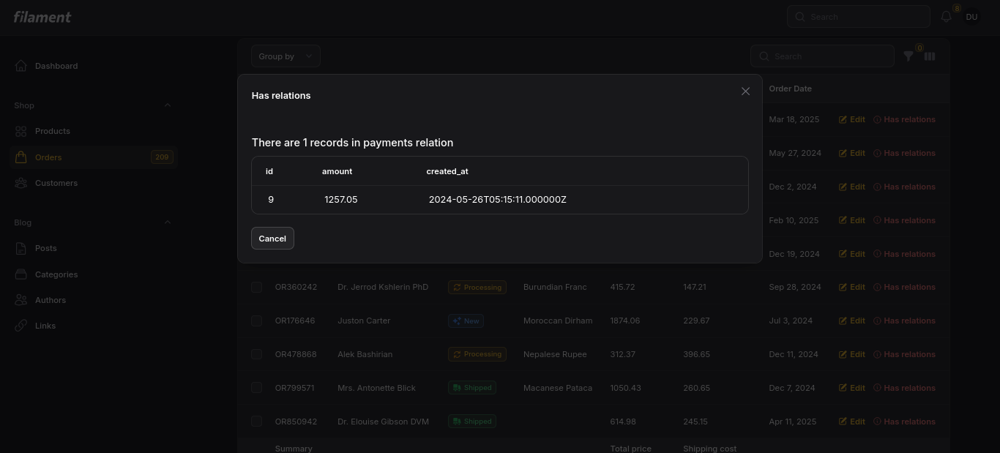

# Has Relations Action for Filament

A Filament action to display related records in a modal.

## Demo

https://github.com/ht3aa/has-relations-filament/blob/main/demo.mp4

## Screenshot



## Installation

You can install the package via composer:

```bash
composer require ht3aa/has-relations
```

## Usage

In your Filament resource, use the action like this:

```php
use Ht3aa\HasRelations\Actions\HasRelations;

public static function table(Table $table): Table
{
    return $table
        ->actions([
            HasRelations::make()
                ->relations([
                    'posts' => [
                        'resource' => PostResource::class,
                        'columns' => ['title', 'slug', 'published_at'],
                    ],
                ]),
        ]);
}
```

## Important Note

**Eager Loading Required**: Before using this action, make sure to eager load the relations in your resource's query. This prevents N+1 query issues and ensures optimal performance.

Example of eager loading in your resource:

```php
public static function getEloquentQuery(): Builder
{
    return parent::getEloquentQuery()
        ->with(['relation_name']);
}
```

## Features

- Displays related records in a modal
- Supports multiple relations
- Customizable columns for each relation
- Localized messages (English and Arabic supported)
- Responsive table layout

## Translation

The package comes with English and Arabic translations. To publish and customize the translations, run:

```bash
php artisan vendor:publish --provider="Ht3aa\HasRelations\HasRelationsServiceProvider" --tag="has-relations-translations"
```

This will copy the translation files to:

- `lang/vendor/has-relations/en/translations.php`
- `lang/vendor/has-relations/ar/translations.php`

You can then modify these files to customize the translations for your application.

## License

The MIT License (MIT). Please see [License File](LICENSE.md) for more information.
